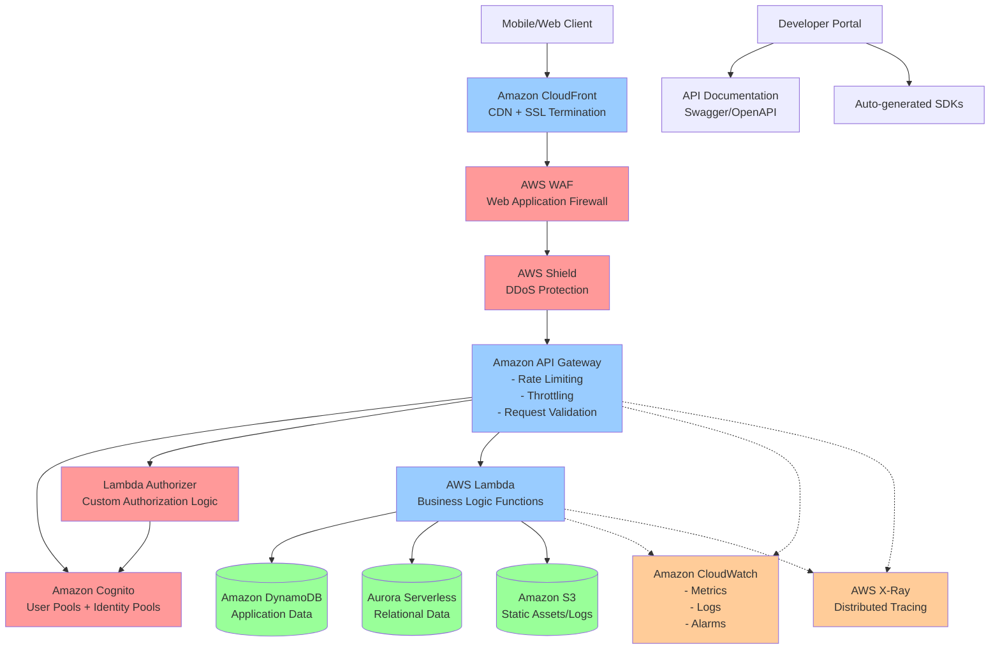

# Secure API Gateway Architecture

## Architecture Diagram

## Request Flow Explanation

### 1. Client Request Initiation
- **Mobile/Web Client** sends API request
- **Developer Portal** provides API documentation and SDKs for integration

### 2. Security and CDN Layer
- **Amazon CloudFront** handles SSL termination and caches responses globally
- **AWS WAF** filters malicious requests (SQL injection, XSS, etc.)
- **AWS Shield** provides DDoS protection at network and transport layers

### 3. API Gateway Processing
- **Amazon API Gateway** receives the request and applies:
  - Rate limiting per client/API key
  - Request throttling based on usage plans
  - Request validation against API schema
  - CORS handling

### 4. Authentication & Authorization
- **Amazon Cognito** validates JWT tokens for authenticated users
- **Lambda Authorizer** performs custom authorization logic
- Fine-grained permissions checked against user roles/scopes

### 5. Business Logic Execution
- **AWS Lambda** functions execute business logic
- Functions access data from **DynamoDB** (NoSQL) or **Aurora Serverless** (SQL)
- Static assets served from **Amazon S3**

### 6. Monitoring & Observability
- **Amazon CloudWatch** collects metrics, logs, and triggers alarms
- **AWS X-Ray** provides distributed tracing across services
- Real-time monitoring of API performance and errors

## Key Security Features

### Threat Protection
- **AWS WAF**: Custom rules for common web exploits
- **AWS Shield Standard/Advanced**: DDoS protection
- **CloudFront**: Geographic restrictions and signed URLs

### Rate Limiting & Throttling
- **Usage Plans**: Different tiers (Basic, Premium, Enterprise)
- **API Keys**: Per-client rate limiting
- **Burst and Steady-state limits**: Configurable per endpoint

### Authentication Mechanisms
- **Cognito User Pools**: User registration and authentication
- **JWT Tokens**: Stateless authentication
- **API Keys**: For service-to-service communication
- **IAM Roles**: For AWS service integration

### Authorization Controls
- **Lambda Authorizers**: Custom authorization logic
- **Cognito Groups**: Role-based access control
- **Resource-based policies**: Fine-grained permissions
- **Scopes and Claims**: OAuth 2.0 compliance

### Monitoring & Logging
- **CloudWatch Metrics**: Request count, latency, errors
- **CloudWatch Logs**: Detailed request/response logging
- **X-Ray Tracing**: End-to-end request tracking
- **Custom Alarms**: Proactive issue detection

### High Availability Features
- **Multi-AZ Deployment**: Automatic failover
- **Auto Scaling**: Lambda concurrency scaling
- **Global Distribution**: CloudFront edge locations
- **Serverless Architecture**: No infrastructure management

### Developer Experience
- **API Documentation**: Auto-generated from OpenAPI specs
- **SDK Generation**: Multiple programming languages
- **Testing Tools**: Built-in API Gateway test console
- **Versioning**: API version management